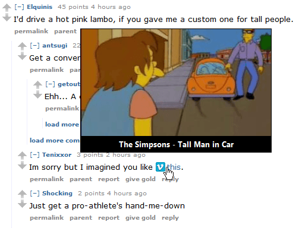
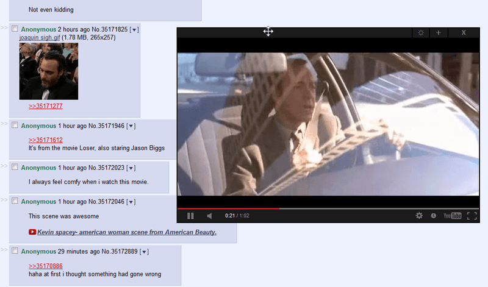

# YouTube Link Title

Adds video thumbnail on mouse hover and embeds video on click. 

Play videos in-line without opening new tabs and scroll page at the same time.

Also supported: Invidious, Vimeo, LiveLeak, Dailymotion, vidme, WorldStarHipHop, Vine, Coub, Streamable.

This script is mostly functional. 

YouTube titles are disabled for now but can be enabled.

Feel free to fork (but change the YouTube API key).

# If you left-click a video link, the video gets embedded and started.
* Time offsets like "t=3m21s" are preserved.
* You can still follow links normally by middle click, Ctrl + click etc.
* Some uploaders don't want their videos to be embedded. These videos will open in a new tab.
* Embed modes:
1. inline (link gets replaced with video)
2. draggable, non-scrolling in-page popup (default)
3. freely resizable popup window (doesn't close when you leave the page)

# Also:
* Support for Invidious (just invidious.osi.kr instance for now), Vimeo, LiveLeak, Dailymotion, vidme, WorldStarHipHop, Vine, Coub and Streamable
* Titles are cached to reduce traffic and delay on subsequent visits.
* To change settings: Monkey toolbar icon → "User Script Commands" → "Set up YouTube Link Title..."

# What it does
* If link text doesn't contain a URL, the video title will be added as tooltip instead.
* A crossed out link indicates that the video is unavailable.
* Move cursor over links to see preview images.
* URLs are rewritten to clean HTTPS addresses.

# Enable YouTube titles
* Just use a nice userscript like [YouTube Peek Preview](https://greasyfork.org/en/scripts/370755-youtube-peek-preview)
* If you really want it enabled in this script, then:
* Uncomment lines 216, 217, and 219
* replace the API key on line 657: after "String.fromCharCode.apply". You can create one in [Developer Console](https://console.developers.google.com/project) using [instructions from here](https://old.reddit.com/r/firefox/comments/cn8w11/any_alternatives_to_youtube_link_title_script/ewf8tap/)
* Before: `net.json('https://www.googleapis.com/youtube/v3/videos?id=' + vid + '&part=' + part.join(',') + '&fields=items(' + fields.join(',') + ')&' + String.fromCharCode.apply(String, [107,101,121,61,65,73,122,97,83,121,68,87,120,79,114,52,76,105,52,65,54,72,116,89,120,57,107,55,98,86,98,67,81,54,56,118,112,119,74,74,117,111,99]), function(code, obj, txt) {`
* After: `net.json('https://www.googleapis.com/youtube/v3/videos?id=' + vid + '&part=' + part.join(',') + '&fields=items(' + fields.join(',') + ')&' + 'key=NEWYOUTUBEAPIKEYHERE', function(code, obj, txt) {` where NEWYOUTUBEAPIKEYHERE is your own API Key

# CSP problems
* Some embeds may fail to load with because of Content Security Policy:

* Content Security Policy can be carefully overidden to allow very specific embeds on chosen websites
* Use an extension like [Content Security Policy Override](https://chrome.google.com/webstore/detail/content-security-policy-o/lhieoncdgamiiogcllfmboilhgoknmpi) very cautiously and at your own risk.
